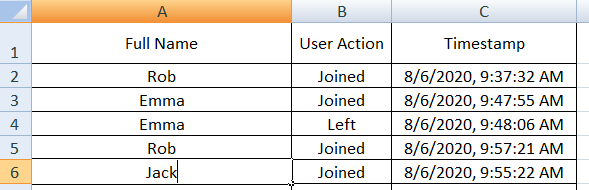
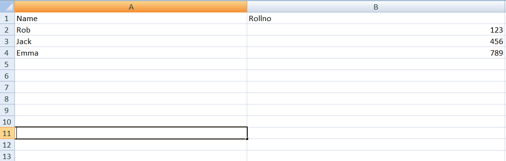
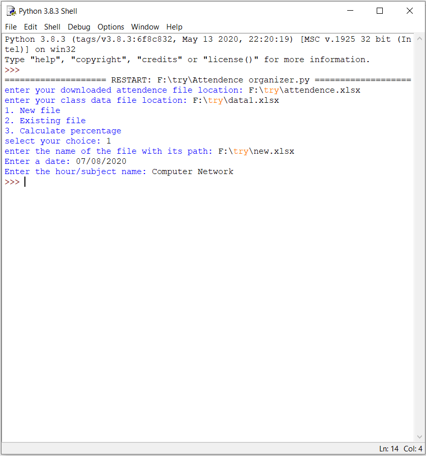
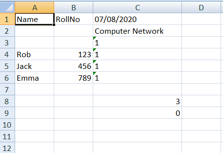
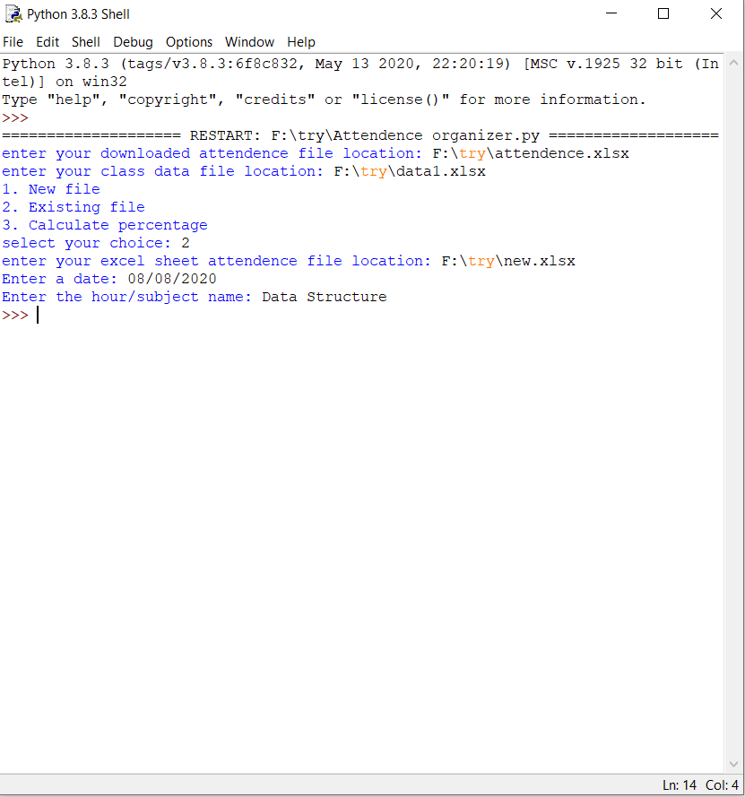
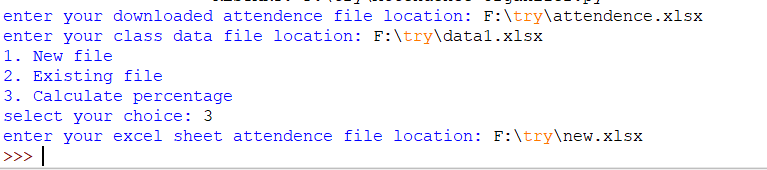
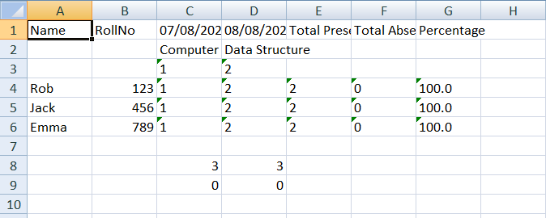

# attendance_organizer_for_online_meeting_applications

This Python3 code will be useful for the subjext teachers, class teachers of the schools , colleges organizing classess using the online meeting tools such as microsoft teams,etc.

Prerequisite:
            During the online meeting the file which is downloaded as .csv should be converted to .xlsx .

Normally the .csv file will contain two coloumns. coloumn 1 - Name of the students column2 - Time of entry and exit.

Another file must be required which contains two columns, column 1 - Student name, column 2 - Roll no of 10 digit.

Software requirments:
              Before usage of this appication make sure you have python3,
              Also make sure to "pip install openpyxl"

In this if a student is absent he will be marked initially "ab|0" , where ab means absent and 0 means number of days he was present.

